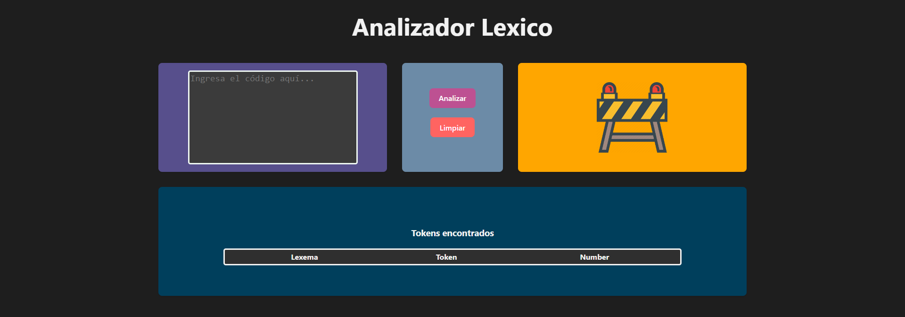
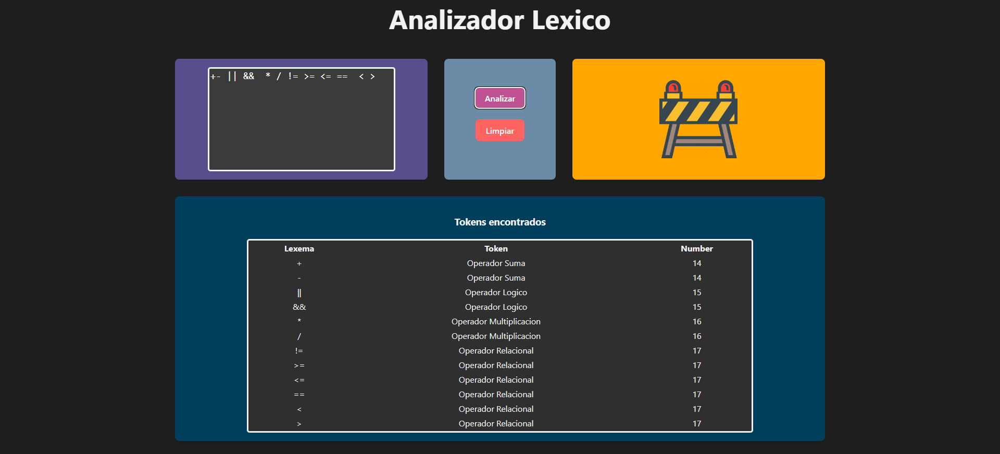
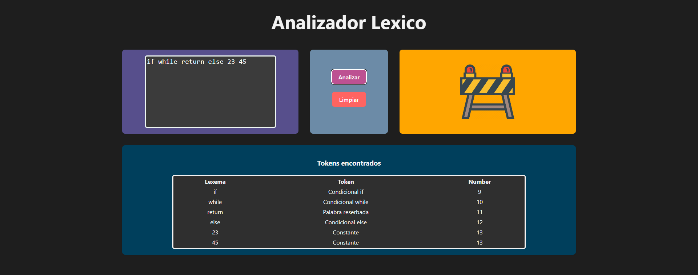
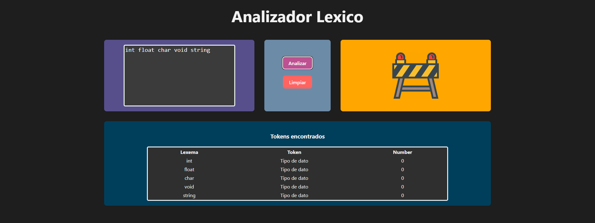
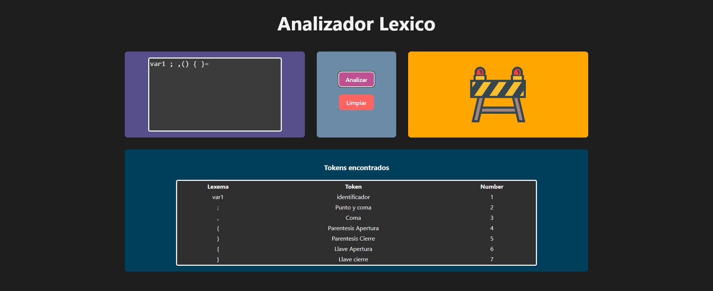

# Analizador lexico con React + Vite

Esta es la interfaz y todo lo que reconoce esta aplicaion.

**Inicio del programa**

**Operadores**

**Palabras reserbadas**

**Tipos de Datos**

**Variables y signos**

